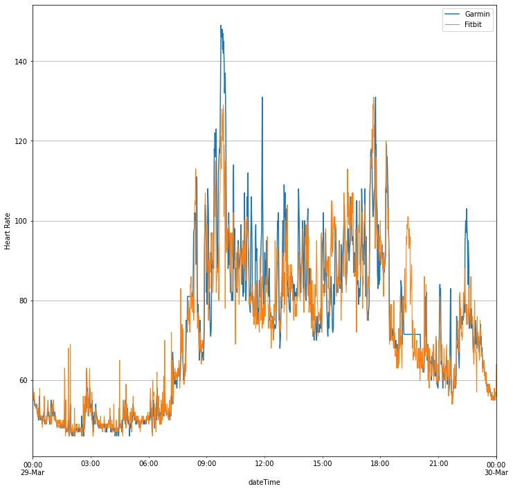
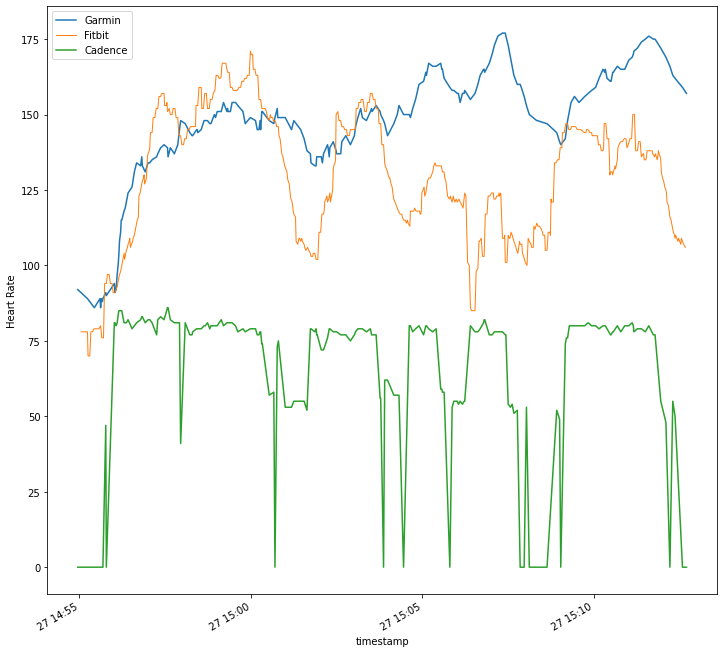
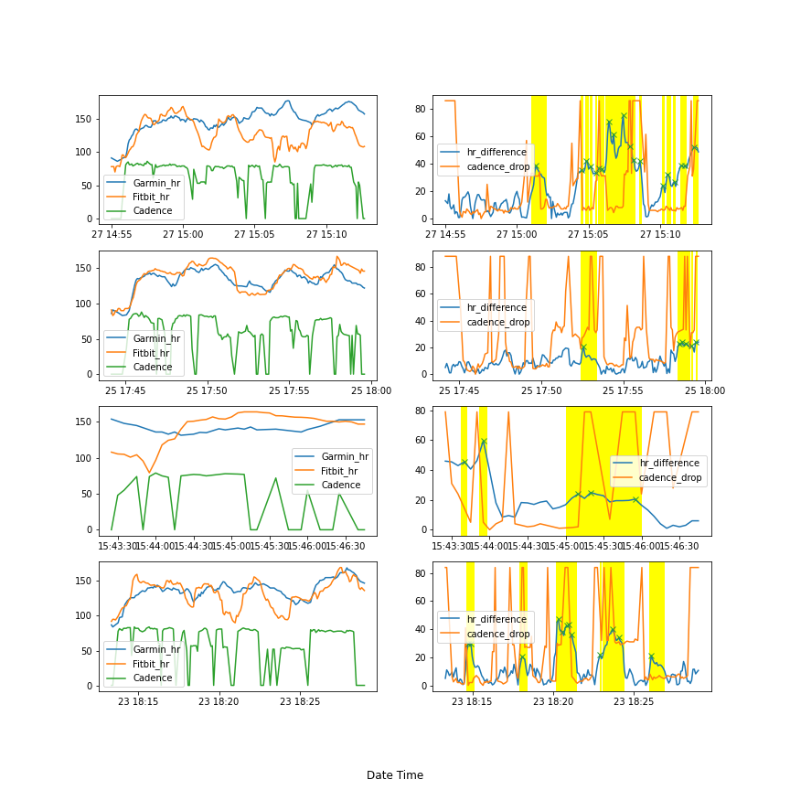

My personal anlysis for fitness data. Data collected using Fitbit Charge 4 and Garmin Style.

I have realized that there is a disagreement between Garmin and Fitbit hr. It is quite obvious from the plot below:

Garmin wacthes tends to have higher spikes comparing with my Fibit charge 4. Which aligns with my hand measurement with metronome. According to forums on Garmin website, there was suggestion that Garmin hr algorithm might be tied with steps or cadence counter. The purpose of this project was to investigate the claim.

The plot above is a more detailed hr comparison during a run. As the plot suggest, he general increase and drop between the two watches agrees, however, there is a big difference between the actual hr measurement.

Let's look at more running data recorded.

The above plots corresponds to heart rate and cadence data on running activities. On the LHS, the plots represent the raw data, and the plots on RHS represent the recorded heart rate between two devices and, and the cadence difference throughout the run. The cadence difference is defined as :

cadence_diff = max(cadence) - cadence.

Note that the cadence has been normalized to a reasanable scale for comparison.

What we are looking as is the conincide of spikes thoughout the run. It suggest that diffence arise when consistent cadence can't be maintained. Most of the time, whenever there is a long cadence, a increase in hr difference is likely to occur. During all of the run, a tight fit of the wathces had been checked. I had been consistently checking my hr manually with metronome in between the run, and Garmin vivomove style tends to be the more inaccurate (+20~30 bpm from manual inspection).

Speculation:
The source of the difference ofhr measurement can come from different reason. Some guesses might be the temperature and humidity when the run were performed.

It might also be directly linked to the algorithm where Garmin produces hr results, as I have noticed the same spike on hr, when sudden movement like standing up and walk after long sitting session, was performed throughout the day. The data suggest that Garmin wearables have issue with sudden movement and hr detection.

UPDATE: I have recently bought a second hand old Garmin Forerunner 45, and the same spikes patterns have been observed. More data is required for the claim.

Conclusion:

It is highly likely that during a activity recording, Garmin's hr detection has correlation to change in movements, hence if you can't run in a consistent pace like me, it's better to avoid such wearables.

Next experiment was to directly examine the correlation between hr and movement outside of activities. Eg, moving arms around, inputting false step counts, with minimal body movement otherwise. If spikes in hr are detected, it will be safe to conclude that the hr detection of Garmin devices are indeed infuence by movement detection, under the assumption that the watches are in a tight fit.

Experiments in broad daylight and completely dark room should be perfromed, to speculate if the brightness of environment affect the hr sensors.
