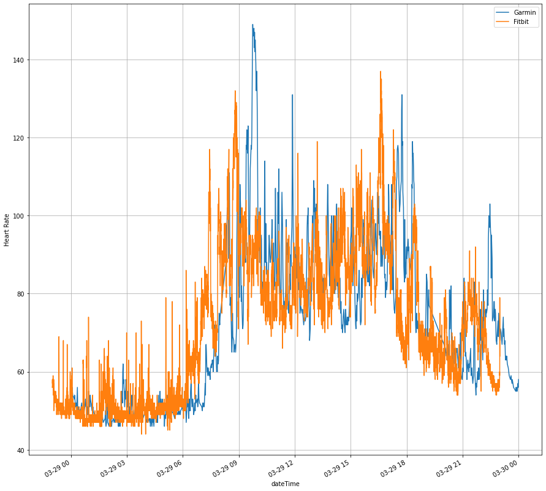

My personal anlysis for fitness data. Data collected using Fitbit Charge 4 and Garmin Style.

I have noticed conflict between my Garmin and Fitbit devices, and have suspected that there is a time delay in either of one devices. As shown as the plot below, the Garmin device has a time delay in reporting heart rate for within an hour. The aim of the project is to determine the time delay for my Garmin device.

The idea is as follows:
1. Determine a loss function for the difference in both devices.
2. Shifting the time stamps in on of the dataframe.
3. Determine the delayed time where loss function is minimized.
4. Check if the delayed time is consistence accross all dates, or activities.

