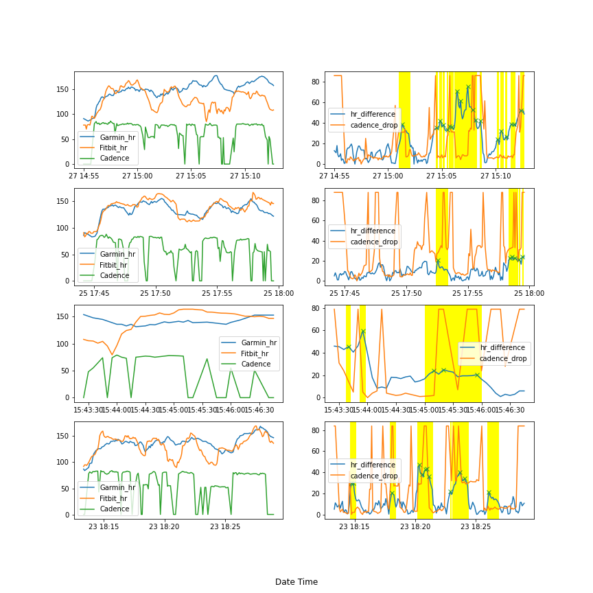

# ML
Machine learning documents
A summary of the files are as follow:

Fitness: My personal project analysing data collected by my fitness tracker. Current fitness trackers I own include Fitbit Charge4, Garmin Vivomove Style and Garmin Forerunner 45s.
The current projects include analysing the disagreement of heart rate data during running activities and its relation with cadence, and analysing heart rate variation trend, and deducing its relation with physical activities (steps, calories burned, heart rate zone minutes) and sleeps (duration in light, deep and REM sleep).
If I still fail to interest you, please look at the plot below:

Kaggle_titanic: My attemps of first kaggle competition, includes data cleaning, prediction age from data by drawing prefixes from names, then feed in to linear regression model.

MMT : Interview question from MMT(Machine Medicine Technology), includes data cleanig, data visualization, movement detection from distace of body parts)

Taxi_fate: GCP public dataset of predicting taxi_fare, include feature engineering of creating new data, creating feature cross etc.

Iris_logistic: Classic logistic question of iris species classification, includes data visualization using seaborn.

Fraud_logistic: An example notebook for highly skewed dataset, includes data_cleaning, visualization, assigning weights for models, etc.
